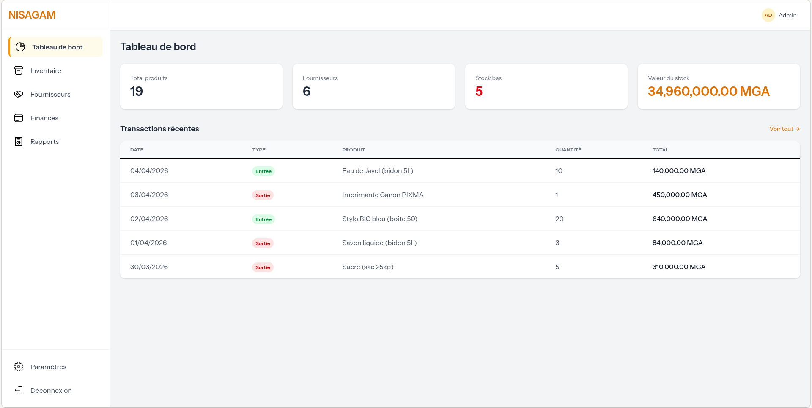
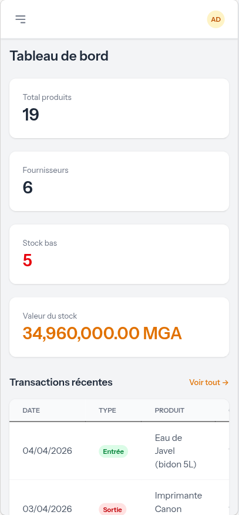

<p align="center">
  
</p>

<h1 align="center">NISAGAM</h1>

<p align="center">
  Système de gestion d'inventaire et de stock pour les entreprises.
</p>

<p align="center">
  <a href="#fonctionnalités">Fonctionnalités</a> •
  <a href="#captures-décran">Captures d'écran</a> •
  <a href="#prérequis">Prérequis</a> •
  <a href="#installation">Installation</a> •
  <a href="#utilisation">Utilisation</a> •
  <a href="#contribution">Contribution</a> •
  <a href="#licence">Licence</a>
</p>

<p align="center">
  
  
  
  
  
</p>

---

## Fonctionnalités

- **Tableau de bord** — Vue d'ensemble avec statistiques en temps réel (produits, fournisseurs, stock bas, valeur totale)
- **Gestion d'inventaire** — CRUD complet des produits avec filtres par catégorie et recherche
- **Fournisseurs** — Gestion des fournisseurs avec coordonnées et suivi des produits associés
- **Finances** — Suivi des transactions d'entrée (achats) et de sortie (ventes) avec mise à jour automatique du stock
- **Rapports** — Synthèse financière, alertes stock bas, classement des produits
- **Paramètres** — Gestion des catégories et des utilisateurs
- **Authentification** — Connexion sécurisée avec sessions
- **Responsive** — Interface adaptée desktop, tablette et mobile avec bottomsheet et sidebar rétractable

## Captures d'écran

| Desktop | Mobile |
|---------|--------|
|  |  |
|  |  |
|  |  |

## Prérequis

- **PHP** >= 8.2
- **Composer** >= 2.x
- **Node.js** >= 18.x et **npm**
- **MySQL** >= 8.0 (ou MariaDB >= 10.6)
- **Git**

## Installation

### 1. Cloner le projet

```bash
git clone https://github.com/votre-utilisateur/nisagam.git
cd nisagam
```

### 2. Installer les dépendances

```bash
composer install
npm install
```

### 3. Configurer l'environnement

```bash
cp .env.example .env
php artisan key:generate
```

Modifier le fichier `.env` avec vos paramètres de base de données :

```env
DB_CONNECTION=mysql
DB_HOST=127.0.0.1
DB_PORT=3306
DB_DATABASE=nisagam
DB_USERNAME=root
DB_PASSWORD=votre_mot_de_passe
```

### 4. Créer la base de données et lancer les migrations

```bash
mysql -u root -p -e "CREATE DATABASE nisagam;"
php artisan migrate
```

### 5. Ajouter les données de démonstration (optionnel)

```bash
php artisan db:seed
```

Cela crée un compte administrateur par défaut :

| Champ        | Valeur              |
|-------------|---------------------|
| **Email**   | `admin@nisagam.com` |
| **Mot de passe** | `password`    |

### 6. Compiler les assets et lancer le serveur

```bash
# Terminal 1 — Serveur PHP
php artisan serve

# Terminal 2 — Vite (hot reload)
npm run dev
```

L'application est accessible sur **http://localhost:8000**.

### Build de production

```bash
npm run build
```

## Utilisation

### Structure des modules

| Module | Route | Description |
|--------|-------|-------------|
| Tableau de bord | `/` | Statistiques et transactions récentes |
| Inventaire | `/inventory` | Gestion des produits |
| Fournisseurs | `/suppliers` | Gestion des fournisseurs |
| Finances | `/finances` | Transactions d'entrée et de sortie |
| Rapports | `/reports` | Synthèse et alertes |
| Paramètres | `/settings` | Catégories et utilisateurs |

### Flux de travail typique

1. **Ajouter des catégories** dans Paramètres
2. **Ajouter des fournisseurs** dans Fournisseurs
3. **Créer des produits** dans Inventaire en les associant à une catégorie et un fournisseur
4. **Enregistrer des transactions** dans Finances — le stock est automatiquement mis à jour
5. **Consulter les rapports** pour suivre les alertes de stock bas et la synthèse financière

## Structure du projet

```
nisagam/
├── app/
│   ├── Http/Controllers/       # Contrôleurs (Product, Supplier, Transaction, etc.)
│   └── Models/                 # Modèles Eloquent (Product, Category, Supplier, Transaction)
├── database/
│   ├── migrations/             # Schéma de la base de données
│   └── seeders/                # Données de démonstration
├── resources/views/
│   ├── components/             # Composants Blade (modal, nav-link, card, layouts)
│   ├── inventory/              # Vues inventaire
│   ├── suppliers/              # Vues fournisseurs
│   ├── finances/               # Vues finances
│   ├── reports/                # Vues rapports
│   └── settings/               # Vues paramètres
├── routes/web.php              # Définition des routes
└── public/images/              # Icônes SVG de navigation
```

## Stack technique

| Technologie | Rôle |
|------------|------|
| [Laravel 12](https://laravel.com) | Framework PHP backend |
| [Tailwind CSS 4](https://tailwindcss.com) | Framework CSS utilitaire |
| [Alpine.js 3](https://alpinejs.dev) | Interactivité frontend (modals, sidebar) |
| [Vite](https://vitejs.dev) | Bundler et hot reload |
| MySQL | Base de données relationnelle |

## Contribution

Les contributions sont les bienvenues ! Voici comment participer :

### 1. Fork et clone

```bash
git fork https://github.com/votre-utilisateur/nisagam.git
git clone https://github.com/votre-fork/nisagam.git
cd nisagam
```

### 2. Créer une branche

```bash
git checkout -b feature/ma-fonctionnalite
```

### 3. Développer et tester

- Respecter le style de code existant (PSR-12 pour PHP)
- Tester vos modifications localement
- S'assurer que `php artisan route:list` et `php artisan view:cache` passent sans erreur

### 4. Commiter et pousser

```bash
git add .
git commit -m "feat: description de la fonctionnalité"
git push origin feature/ma-fonctionnalite
```

### 5. Ouvrir une Pull Request

- Décrire clairement les changements
- Ajouter des captures d'écran si nécessaire
- Référencer les issues liées

### Convention de commits

| Préfixe | Usage |
|---------|-------|
| `feat:` | Nouvelle fonctionnalité |
| `fix:` | Correction de bug |
| `docs:` | Documentation |
| `style:` | Formatage, style (pas de changement de logique) |
| `refactor:` | Refactorisation de code |

### Signaler un bug

Ouvrez une [issue](https://github.com/votre-utilisateur/nisagam/issues) avec :
- Description du problème
- Étapes pour reproduire
- Comportement attendu vs observé
- Captures d'écran si applicable

## Licence

Ce projet est distribué sous la licence **MIT**. Voir le fichier [LICENSE](LICENSE) pour plus de détails.

---

<p align="center">
  Fait avec <b>Laravel</b>, <b>Tailwind CSS</b> et <b>Alpine.js</b>
</p>
